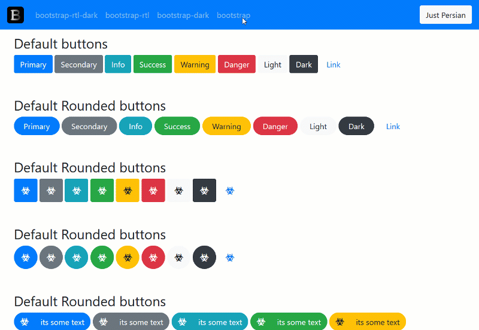

<p align="center">  
  <a href="https://mrjelveh.github.io/BootsDrac/">  
      
  </a>  
</p>
<h1 align="center">
	Bootstrap 4.4.1 RTL With Dark Mode
<h1>
<h2 align="center">
  BOOTS🧛‍♂️
</h2>

<div align="center"><a target="_blank" href="./demo/Bootsdrac.gif"></a></div>


## Installation

On npm:

`npm i bootsdrac`

or

Download files:
[Download compiled file](https://github.com/mrjelveh/BootsDrac/releases/download/1.0.0/Bootsdrac-Compiled-v1.0.0-dist.zip) | [Download source file](https://github.com/mrjelveh/BootsDrac/archive/1.0.0.zip) | 
|---|---|---|

## What is Bootsdrac?

A front-end framework based on the latest version of Bootstrap with extra abalities: 

➡️ RTL version of bootstrap without reversing and code overwriting.

➡️ Dark theme.

➡️ Multicolor & different sizes for pagination and custom switches, rounded option for all components.

 **📑 You can use Bootstrap documention:** 

[Bootstrap documention](https://getbootstrap.com/docs/4.4/getting-started/introduction)  


## What's included
  
Within the download you'll find the following directories and files, logically grouping common assets and providing both compiled and minified variations. You'll see something like this:  
  
```text  
bootstrap/  
└── dist/  
    ├── css/  
    │   ├── bootstrap-dark.css  
    │   ├── bootstrap-dark.css.map  
    │   ├── bootstrap-grid.css  
    │   ├── bootstrap-grid.css.map  
    │   ├── bootstrap-reboot.css  
    │   ├── bootstrap-reboot.css.map  
    │   ├── bootstrap-reboot.min.css  
    │   ├── bootstrap-reboot.min.css.map  
    │   ├── bootstrap-rtl-dark.css  
    │   ├── bootstrap-rtl-dark.css.map  
    │   ├── bootstrap-rtl.css  
    │   ├── bootstrap-rtl.css.map  
    │   ├── bootstrap.css  
    │   └── bootstrap.css.map  
    └── js/  
        ├── bootstrap.bundle.js  
        ├── bootstrap.bundle.js.map  
        ├── bootstrap.bundle.min.js  
        ├── bootstrap.bundle.min.js.map  
        ├── bootstrap.js  
        ├── bootstrap.js.map  
        ├── bootstrap.min.js  
        └── bootstrap.min.js.map  
```

## For kickass developers who want to help me or change the codes:

🔹 First of all don't forget `npm i`.

🔹 I used `gulp` as package manager.

🔹 For darkmode theme I added another variable file: `_variables_dark.scss`.

🔹 I added some extra things to Bootstrap (like custom buttons, Custom switches and etc), If you want to remove it or edit it you can find it in this directory:

```text  
bootstrap/  
└── scss/  
    └── dracs-addons/  
        ├── _addons-main.scss  
        ├── _addons-mixins.scss  
        └── _addons-variables.scss
```
